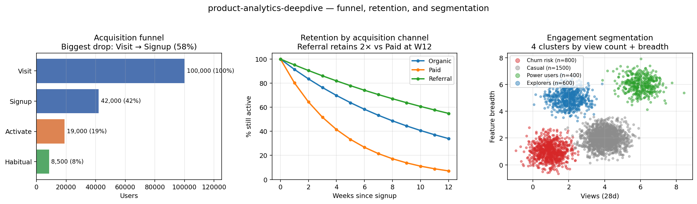

# Product Analytics Deep-Dive

> End-to-end product analytics case studies: funnels, retention cohorts, engagement segmentation, and north-star metric design. SQL-first, memo-driven.




A small set of case studies covering the analytics work that sits behind product decisions: defining the metric, writing the query, reading the cohort, and writing the memo. Each case is framed around a concrete business question rather than a method in isolation.

Intended audience: analysts and data scientists who want a reference for shape-of-the-answer product work, and hiring managers or interviewers who want to see SQL and memo output side by side.

## Case studies

| # | Case study | Primary concepts | Status |
|---|-----------|------------------|--------|
| 01 | [Funnel and retention on simulated e-commerce](case-studies/01-funnel-and-retention/) | Conversion funnel, cohort retention, north-star framing | Complete |
| 02 | [Cohort engagement and segmentation](case-studies/02-engagement-segmentation/) | RFM, L-28 power-user curve, k-means | Complete |
| 03 | [North-star metric design memo](case-studies/03-north-star-metric/) | Metric tradeoffs, WAU × conversion decomposition, gaming risk | Complete |

Each case includes:

1. A business question framed as a PM / DS partnership would frame it.
2. An explicit metric definition with the tradeoffs stated.
3. SQL (Postgres, Spark SQL, DuckDB) as the primary tool.
4. Python where SQL does not express it cleanly (bootstrap intervals, charts).
5. A memo that would survive an interview take-home review.

## Stack

- **DuckDB** as the portable SQL engine (window functions, runs locally).
- **Spark SQL** for scale patterns, with dialect notes where it differs.
- **Python**: pandas, numpy, matplotlib for analysis and charts.
- **[experiment-toolkit](https://github.com/wavde/experiment-toolkit)** where the analytics layer needs CUPED, sequential tests, or staggered DiD.

## How to run

```bash
python -m venv .venv
.venv\Scripts\activate          # Windows
pip install -r requirements.txt
pytest                          # smoke tests; regenerates data and validates queries
```

Each case study has its own README and reproducer.

## Out of scope

No production pipeline, no orchestration framework, no warehouse modelling guidance beyond what the queries demonstrate. The datasets are simulated; they are structured to behave realistically, not to represent any specific company's data.

## License

MIT. See [LICENSE](LICENSE).
